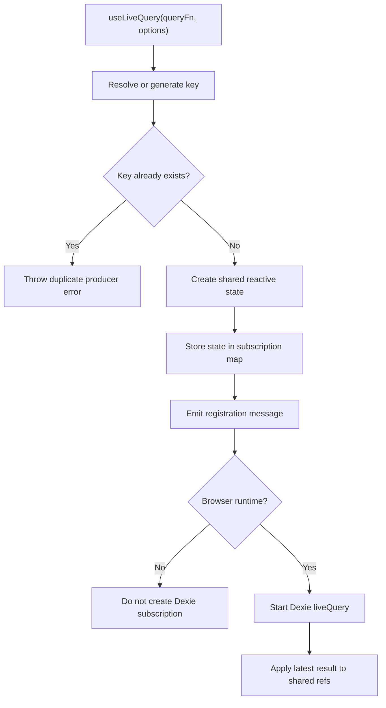
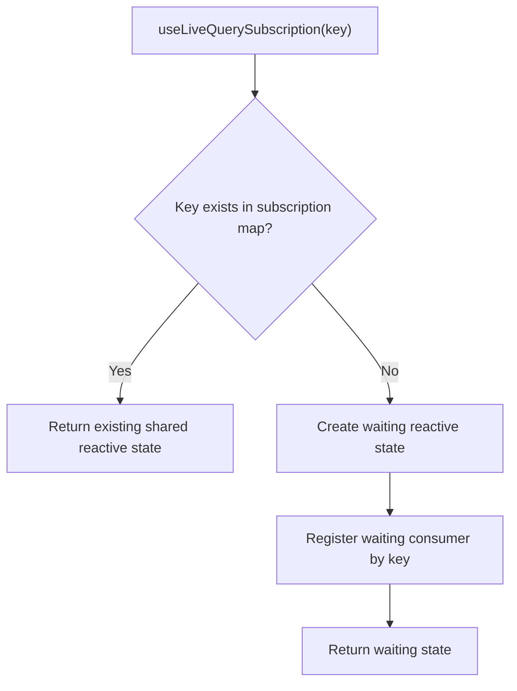
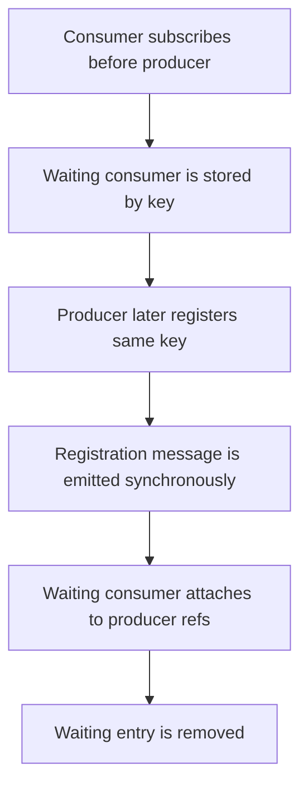
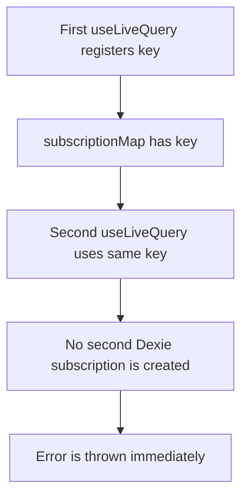

# dexie-reactive

Shared, SSR-safe Dexie live query state for Vue 3 and Nuxt 3.

`dexie-reactive` wraps Dexie `liveQuery` with small Vue composables. One
component owns the real Dexie subscription as a producer. Other components can
subscribe to the same reactive state by key without creating another Dexie
subscription.

## Why dexie-reactive?

Use `dexie-reactive` when multiple Vue components need to react to the same
Dexie query result without each component creating its own IndexedDB
subscription.

It provides:

- one producer-owned Dexie `liveQuery` per key
- shared Vue reactive state for all consumers
- duplicate producer protection
- SSR-safe client-only subscription behavior
- same-origin tab-to-tab updates through Dexie live query propagation
- persistent IndexedDB-backed state for query results without keeping the whole
  database in memory
- stale result protection during restarts and component cleanup
- explicit loading and error state
- focused unit and browser integration test coverage

This keeps IndexedDB reactivity predictable in Vue and Nuxt apps while leaving
Dexie query construction fully under application control.

## Decision Guide

| Use this package when                                                         | Avoid it when                                                 |
| ----------------------------------------------------------------------------- | ------------------------------------------------------------- |
| multiple components share the same IndexedDB query result                     | each component owns completely independent queries            |
| you want explicit producer and consumer ownership                             | you want implicit global query caching                        |
| you need Nuxt-safe client-only IndexedDB behavior                             | you need server-side IndexedDB execution                      |
| you want Dexie queries to stay application-owned                              | you want a query builder or ORM abstraction                   |
| duplicate shared subscription ownership should fail immediately               | duplicate subscriptions are acceptable in your design         |
| you want IndexedDB-backed state that behaves like persistent shared app state | you need a general-purpose Pinia replacement for all UI state |
| you need same-origin tab-to-tab updates from Dexie writes                     | you need cross-device or backend synchronization              |

## What It Does Not Do

- It does not replace Dexie.
- It does not replace Pinia for transient UI state.
- It does not build or parse queries.
- It does not sync data to a backend.
- It does not sync data across devices, users, or origins.
- It does not provide persistence beyond IndexedDB.
- It does not create server-side data fetching.
- It does not hide duplicate ownership mistakes.

## When To Use It

Use this package when a Vue or Nuxt app needs IndexedDB data that updates
reactively after Dexie writes.

- Use `useLiveQuery` in the component or composable that owns the query.
- Use `useLiveQuerySubscription` in components that only need to display the
  already shared state.
- Use an explicit `key` when multiple components should share one subscription.
- Omit the key for local, non-shared live queries.

## Installation

```sh
npm install dexie-reactive dexie vue
```

`dexie` and `vue` are peer dependencies. Nuxt users can install the package in a
Nuxt 3 project and import the composables directly from `dexie-reactive`.

## Quick Start

Define your Dexie database once:

```ts
// db.ts
import Dexie, { type EntityTable } from 'dexie'

export interface Friend {
    id?: number
    name: string
    age: number
}

export interface AppDatabase extends Dexie {
    friends: EntityTable<Friend, 'id'>
}

export const db = new Dexie('app-db') as AppDatabase

db.version(1).stores({
    friends: '++id,name,age',
})
```

Create a producer composable:

```ts
// useOlderFriends.ts
import { useLiveQuery } from 'dexie-reactive'
import { db } from './db'

export function useOlderFriends() {
    return useLiveQuery(() => db.friends.where('age').above(75).toArray(), {
        key: 'older-friends',
    })
}
```

Use it in a producer component:

```vue
<script setup lang="ts">
import { useOlderFriends } from './useOlderFriends'

const { data, loading, hasError } = useOlderFriends()
</script>

<template>
    <p v-if="loading">Loading...</p>
    <p v-else-if="hasError">Could not load friends.</p>
    <ul v-else>
        <li v-for="friend in data" :key="friend.id">
            {{ friend.name }}
        </li>
    </ul>
</template>
```

Use the same state from a consumer component:

```vue
<script setup lang="ts">
import { useLiveQuerySubscription } from 'dexie-reactive'
import type { Friend } from './db'

const { data, loading, hasError } =
    useLiveQuerySubscription<Friend>('older-friends')
</script>

<template>
    <p v-if="loading">Loading...</p>
    <p v-else-if="hasError">Could not load friends.</p>
    <ul v-else>
        <li v-for="friend in data" :key="friend.id">
            {{ friend.name }}
        </li>
    </ul>
</template>
```

## Core Model

`useLiveQuery` is the producer. It owns the real Dexie live query subscription.

`useLiveQuerySubscription` is the consumer. It attaches to shared state by key
and never creates a Dexie subscription.

The consumer receives shared reactive state by key. It does not get a cloned
snapshot and it does not create a second Dexie subscription.

## Public API

The package exports only the stable composables and public types:

```ts
import {
    useLiveQuery,
    useLiveQuerySubscription,
    type LiveQueryState,
    type UseLiveQueryOptions,
} from 'dexie-reactive'
```

### `useLiveQuery(queryFn, options?)`

Creates and owns a Dexie live query subscription.

```ts
function useLiveQuery<T>(
    queryFn?:
        | (() => T[] | Promise<T[]>)
        | Ref<(() => T[] | Promise<T[]>) | null | undefined>
        | null,
    options?: {
        key?: string
    },
): LiveQueryState<T>
```

- `queryFn` is a function that returns an array or a promise of an array.
- `queryFn` may be passed directly or as a reactive function reference.
- `options.key` is optional. If omitted, a UUID key is generated and returned.
- Only one producer may exist for a key.
- The live query is created only in the browser.

### `useLiveQuerySubscription(key)`

Consumes existing shared state by key.

```ts
function useLiveQuerySubscription<T>(key: string): LiveQueryState<T>
```

- Receives only a key.
- Never receives a query function.
- Never creates a Dexie live query subscription.
- Returns the same reactive refs as the producer once the producer exists.

### Returned State

Both composables return:

```ts
interface LiveQueryState<T> {
    key: string
    data: Ref<T[]>
    loading: Ref<boolean>
    hasError: Ref<boolean>
    error?: Ref<unknown | undefined>
    stop: () => void
    restart: () => void
}
```

`error` is available only in development mode. Production consumers should rely
on `hasError`.

## Generated Key Usage

If no key is provided, `useLiveQuery` generates a UUID key and returns it.

```ts
const friends = useLiveQuery(() => db.friends.toArray())

console.log(friends.key)
```

Generated keys are useful for local, non-shared subscriptions. Use an explicit
key when another component needs to subscribe to the same state.

## Error Handling

Errors are caught internally and do not throw to components.

```ts
const friends = useLiveQuery(() => db.friends.toArray(), {
    key: 'friends',
})

if (friends.hasError.value) {
    // Render fallback UI or trigger app-level reporting.
}
```

On failure:

- `hasError.value` becomes `true`
- `loading.value` becomes `false`
- `data.value` remains an array
- the original error is exposed only through `error` in development mode

## Query Function Behavior

The package passes your function to Dexie `liveQuery`; it does not parse, build,
transform, or interpret Dexie queries.

```ts
const query = () => db.friends.where('age').above(75).toArray()

const friends = useLiveQuery(query, { key: 'older-friends' })
```

Reactive values used inside the query function are not tracked by
`dexie-reactive`. If external dependencies change, recreate the query function
reference.

```ts
import { computed } from 'vue'

const minimumAge = ref(75)
const query = computed(
    () => () => db.friends.where('age').above(minimumAge.value).toArray(),
)

const friends = useLiveQuery(query, { key: 'filtered-friends' })
```

When the query function reference changes, the composable stops the current
subscription, resets state to `data = []`, `loading = true`, `hasError = false`,
and starts a new subscription.

## SSR And Nuxt

The same package build works in plain Vue and Nuxt.

During SSR:

- no Dexie live query subscription is created
- shared state is scoped per runtime environment
- browser state is not shared with SSR
- SSR request state is isolated and cannot leak across requests

Use the composables in Nuxt components or composables, but expect live Dexie
updates only on the client because IndexedDB is a browser API.

```vue
<script setup lang="ts">
import { useLiveQuery } from 'dexie-reactive'

const friends = useLiveQuery(() => db.friends.toArray(), {
    key: 'friends',
})
</script>
```

## Lifecycle Controls

`stop()` unsubscribes from Dexie, sets `loading` to `false`, and keeps current
data.

`restart()` performs a full reset and starts a new subscription using the latest
query function.

For shared keys, these controls affect all consumers because they point to the
producer-owned state.

## Flow Diagrams

### Producer Flow



### Consumer Flow



### Waiting Consumer Flow



### Duplicate Producer Error Flow



## Limitations

- Dexie queries must return arrays.
- Consumers cannot create subscriptions.
- Keys are identifiers for shared state, not a security boundary.
- Live queries run only in the browser.
- The package uses vanilla Dexie `liveQuery` semantics through the composables.
- It does not use framework-specific Dexie bindings such as React hooks.

## Anti-Patterns

Do not create duplicate producers for the same key:

```ts
useLiveQuery(() => db.friends.toArray(), { key: 'friends' })
useLiveQuery(() => db.friends.toArray(), { key: 'friends' }) // throws
```

Do not pass query functions to consumers:

```ts
useLiveQuerySubscription('friends') // correct
useLiveQuerySubscription(() => db.friends.toArray()) // incorrect
```

Do not rely on reactive values inside a stable query function reference:

```ts
const minimumAge = ref(75)

useLiveQuery(() => db.friends.where('age').above(minimumAge.value).toArray(), {
    key: 'friends',
})
```

Recreate the query function when dependencies change instead.

## Demo And Browser Integration Test

The browser test app doubles as a small local demo:

```sh
npm run test:browser:server
```

Open the printed local URL and inspect IndexedDB under that same origin. The demo
database is named `dexie-reactive-browser` and uses a `friends` object store.

## Testing Strategy

The unit test suite focuses on the shared live query contract:

- public API exports and returned reactive state shape
- browser singleton and SSR-isolated subscription scopes
- producer lifecycle for start, stop, restart, unsubscribe, and cleanup
- duplicate producer rejection without creating a second Dexie subscription
- consumer coordination for producer-first and waiting-consumer flows
- shared reactive state references instead of cloned consumer state
- stale result protection across stop, restart, scope disposal, and rapid query changes
- missing, invalid, and changing query function handling
- error, loading, and development-only error exposure behavior
- generated UUID key uniqueness
- Dexie `liveQuery` usage through the provided query callback

The browser integration suite mounts a minimal Vue app in Chromium with a real
Dexie IndexedDB database. It verifies producer and consumer components sharing
one key, database updates propagating to all mounted components, consumer
unmount/remount behavior, and duplicate producer errors in the browser runtime.

## Scripts

- `npm run lint` checks the code with ESLint.
- `npm run format:check` verifies Prettier formatting.
- `npm run typecheck` runs TypeScript without emitting files.
- `npm run test` runs Vitest tests from `tests/*`.
- `npm run test:browser` runs Playwright browser integration tests.
- `npm run build` builds the package with unbuild.
- `npm run check` runs linting, formatting, type checking, tests, and build.

## Git Hooks

Husky runs staged linting before commits and commitlint for commit messages.
